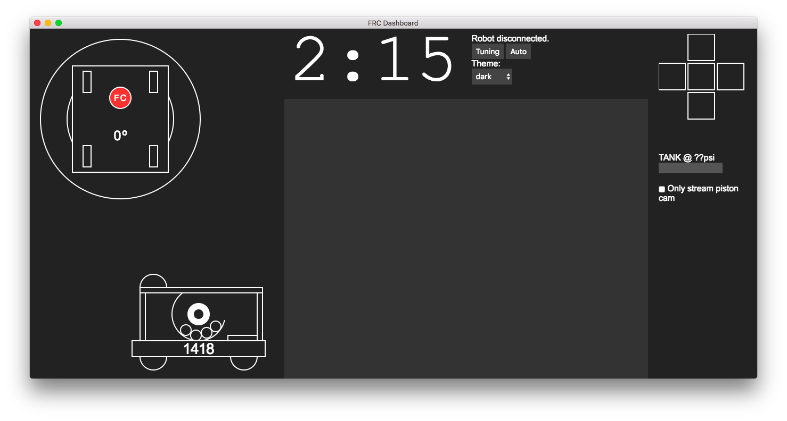

# 2017 Dashboard
[Robot Code](https://github.com/frc1418/2017-robot) | **Dashboard** | [Vision](https://github.com/frc1418/2017-vision)

This is FIRST Robotics Team 1418's 2017 driving dashboard, built off of the [FRC Dashboard](https://github.com/FRCDashboard/FRCDashboard) web driving dashboard framework.

## Setup
### Dependencies
* Python 3 **(MUST be 3, not 2!)**
* `pynetworktables2js`

        pip3 install pynetworktables2js

    If you don't have administrator privileges, put `--user` at the end of that command.)

If you're going to be using the preferred method of using the dashboard (as an application through Electron), you'll also need:
* [`nodejs`](https://nodejs.org) & [`npm`](https://npmjs.com)
    * If you don't have permission to install these, see [this gist](https://gist.github.com/isaacs/579814) for a workaround.
* Node dependencies (to install, `cd` into dashboard directory and run `npm install`)

### Configuration
* In `ui.js`, there's a large `switch` statement in the `onValueChanged()` function which controls the updating of control elements in the dashboard. Example NetworkTables key names are used, but you'll need to change them to match those used in your team's robot code for them to affect anything on your robot.

#### Configuring Camera feed
In order to run the camera, you must start an `mjpg-streamer` server on the RoboRIO. To install `mjpg-streamer`:

1. Download [this installer script](https://raw.githubusercontent.com/robotpy/robotpy-wpilib/master/installer/installer.py) from GitHub. This script is for downloading and installing packages to the RoboRIO.
2. While in the directory where you downloaded the installer script, run:

    Windows:

        py -3 installer.py download-opkg mjpg-streamer
        py -3 installer.py install-opkg mjpg-streamer

    Mac/Linux (using bash):

        python3 installer.py download-opkg mjpg-streamer
        python3 installer.py install-opkg mjpg-streamer

3. Update `style.css` to use the IP of your live camera feed. Usually this is something like `roborio-XXXX-frc.local:5800/?action=stream`, where `XXXX` is your team's number.

## Running
1. Connect to your robot's network if you haven't already. (If you're just testing the dashboard and don't currently need to use it with your robot, you can skip this step.)
2. If you are able to use node/npm, use the section below labeled "Using dashboard as Application." If not, use the section titled "Using dashboard through web browser."

### Using dashboard as Application
The preferred method of using the dashboard is to run it using the [Electron](http://electron.atom.io) framework. Your dashboard will be its own application, and will be easy to manipulate.

If you need to interact through the robotpy simulator or similar, run the following command. If not, skip on.

    python3 -m pynetworktables2js --robot 127.0.0.1

While in the dashboard directory, run:

    npm start

This will start a Python server and open the dashboard application. Note that you don't have to close and reopen the application every time you make a change, you can just press `Ctrl+R` (`Cmd+R` on Mac) to refresh the application.

### Using dashboard through web browser
The less desirable, but perfectly functional method of viewing your dashboard is to use it like a webpage. This method will work even if you don't have the privileges to install `node.js` and `npm`. The standard toolbars from your browser will still be shown and will take up space on the screen, and the experience will be a bit less fluid, but it will work.

1. Start the Python server independently:

    Windows:

        py -3 -m pynetworktables2js

    Mac/Linux (using bash):

        python3 -m pynetworktables2js

2. To view the dashboard, use your browser to navigate to `http://localhost:8888`.

It is recommended that while using the dashboard on your driver station, you close the top panel of the FRC DriverStation to make room for the dashboard.

## Authors
* [Erik Boesen](https://github.com/ErikBoesen), developer of FRC Dashboard and head of UI team
* [Aki Maher](https://github.com/17mahera), art

Special Thanks to [Dustin Spicuzza](https://github.com/virtuald), mentor and head of the [RobotPy](http://github.com/robotpy) project, and [Leon Tan](https://github.com/lleontan), developer of pynetworktables2js and former UI team lead.

## Modifying
FRC Dashboard, and by consequence this software, is licensed under the MIT license. Basically, modify as much as you like, as long as you give credit to the [original source](https://github.com/FRCDashboard/FRCDashboard) and don't hold us accountable for anything. More information in `LICENSE`.
